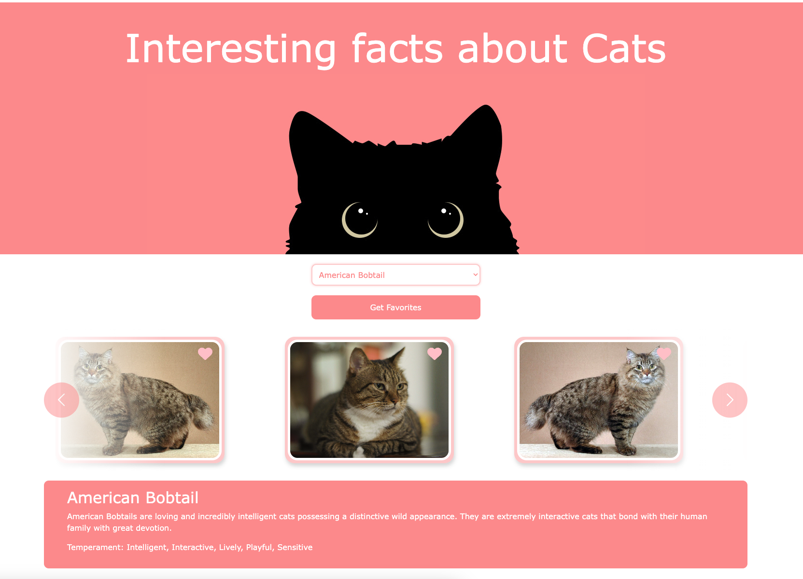

# 🐱 Cat Facts Carousel

A fun and interactive web application that presents interesting facts about cats using a visually appealing carousel! This project fetches data from the Cat API and displays it in a user-friendly format using JavaScript, Axios, and Bootstrap.

## 🎯 Features

- **Breed Selection:** Choose from various cat breeds to explore unique facts.
- **Favorites:** Mark your favorite cat images.
- **Responsive Design:** Smooth experience on any device.

## 🛠️ Technologies Used

- **JavaScript**
- **Axios**
- **Bootstrap**
- **Cat API**
